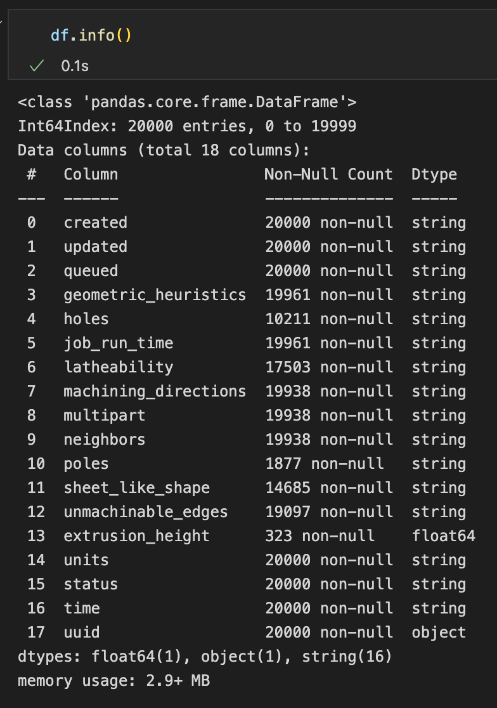
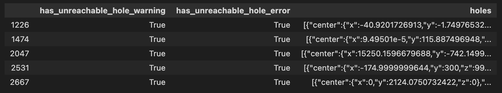
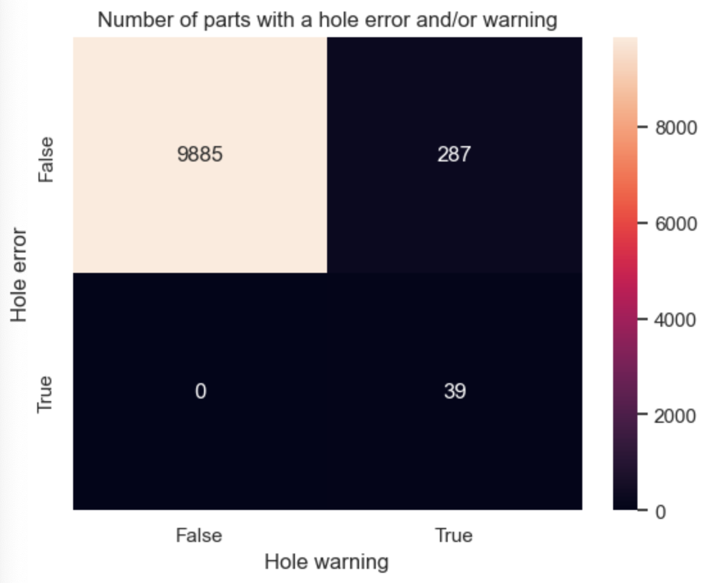
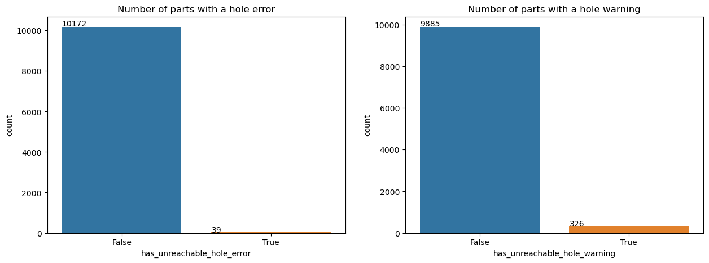
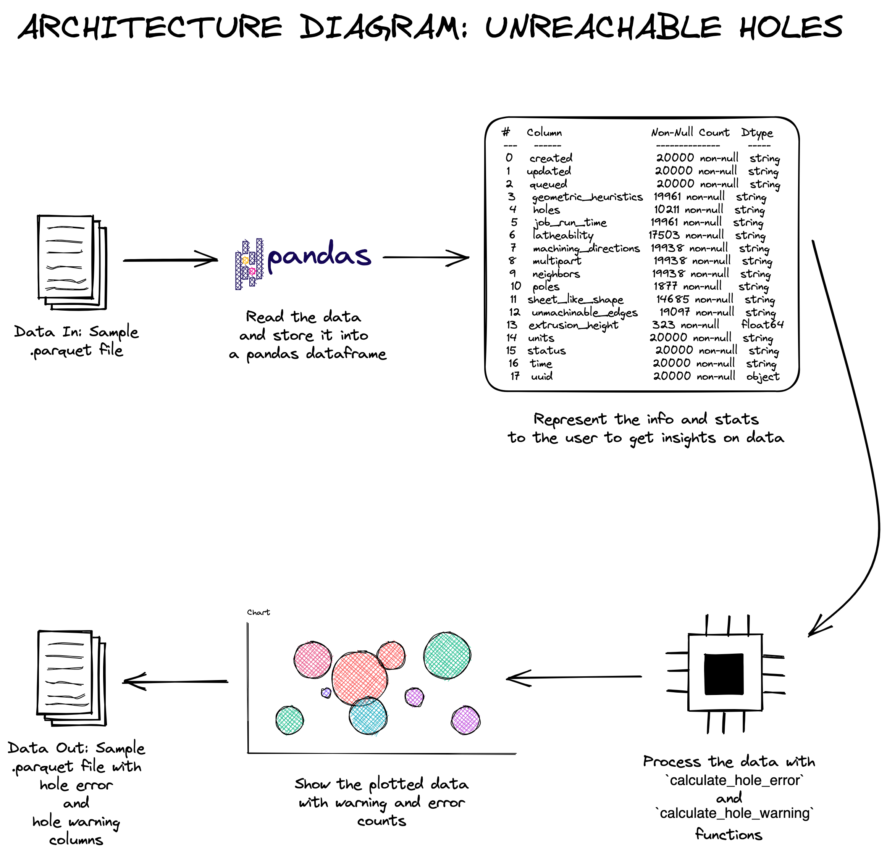

# Hubs-take-home

# How to Run?

- Clone the repository into your local system, and move into the directory.
    
    ```bash
    git clone https://github.com/ediziks/hubs-take-home.git
    cd hubs-take-home
    ```

- Install the requirements.
    
    ```bash
    pip install -r requirements.txt
    ```

- Create a new folder named as `data/` and copy `2023 DE_case_dataset.gz.parquet` (sample data given in the instructions) file into it. Change `../path/to` part to the corresponding folder path.
    
    ```bash
    mkdir data
    cp ../path/to/2023 DE_case_dataset.gz.parquet ./data
    ```
    
- Open the notebook file (`unreachable_holes.ipynb`) and run the cells. Alternatively, you could open the notebook in your code editor directly if it feels more comfortable.
    
    ```bash
    jupyter notebook unreachable_holes.ipynb
    ```
    
- Finally, the new `parquet` file can be found under `data/` folder named as `2023 DE_case_dataset_holes_error_warning.gz.parquet`.
<br>

# Insights

- There were many string columns where I assumed they would be misleading in data processing step but there was no need to do any Data Type conversion considering all the string columns were holding data similar to json format. So, it was better to load the data in json format and then doing the evaluations.

    <p style="text-align:center;"></p>

- There were *9789* `null` values in the `holes` column, these rows could be filled if there would be meaningful values that are extractable from the other columns, or values that could be dropped to increase the processing speed since the `null` hole values are making *~%49* of the data. But none of the choices would be applicable in this case since there is no values to fill from - *indeed, the part might not have any hole at all -,* or a big dataset would make the process slower. So, it is better to keep as it is to have an insight about the non-processable data in the output.
- Both `warning` and `error` values are calculated considering the given formula as mentioned below. In fact, values having `error` were including the values having `warning` in every occurrence. There could be 2 alternative representing options for values having `warning`:
    
    ```bash
    length > radius * 2 * 10  (poor ratio → warnings)
    length > radius * 2 * 40  (critical ratio → errors)
    ```
    
    - **Option 1**: Leaving `has_unreachable_hole_warning` column `empty or NA` for the values having `has_unreachable_hole_error` as `True`.
    - **Option 2**: Labelling `has_unreachable_hole_warning` column as `True` when the `has_unreachable_hole_error` is `True` as well.
    
    I followed the **Option 2** as in the sample below since there might be misleading values in `has_unreachable_hole_warning` when it is inspected without taking `has_unreachable_hole_error` column into consideration.
    
    <p style="text-align:center;"></p>
    
- Two functions named as `calculate_hole_error` and `calculate_hole_warning` defined to calculate the `error` and `warning` conditions in the dataframe. Both of these functions take `holes` input as the parameter and return the result as `True` if there is a warning/error, and `False` otherwise. These functions are slightly differ from each other at the point where the condition is checked.
- The functions explained above applied to `has_unreachable_hole_error` and `has_unreachable_hole_warning` columns respectively while creating the columns on the go. The built-in `df.apply()` method is used to construct 2 new columns instead of iterating within a loop considering the performance and code readability.
- Alternatively, there could be a single common function to check the conditions at once after creating the two new columns with all `null` values and then applying the function only once. It would be more preferable if there would be a big dataframe to process. The method used is preferred because I believe it is easier to read and modify them, considering the code maintainability.
- `has_unreachable_hole_error` and `has_unreachable_hole_warning` columns moved next to `holes` column to make it easier to read. Afterwards, A heatmap with the counts of `True` and `False` values as below is created to have more understanding about the data. Also, two sub-countplots created to see the `True` and `False` values in a chart individually for error and warning counts. These charts does not consider the holes with `null` values (9789 in total).

    <p style="text-align:center;"></p>

- Considering the plot, it could be said that there are:
    - 39 parts have unreachable hole error over 10211 parts having a hole. Around ~%0.38, and ~%0.19 considering the whole parts.
    - 287 parts have unreachable hole warning (**without hole error**). Around ~%2.81, and ~%1.43 considering the whole parts.
    - 326 parts have unreachable hole warning (******************************both with & without hole error******************************). Around ~%3.19, and ~%1.63 considering the whole parts.

    <p style="text-align:center;"></p>

- While doing the task, I assumed that parts not having any value in holes column are not having any hole at all. Otherwise, it would be not be possible to estimate the `null` values since there is no any relation with other columns or another data source to extract from.
- Finally, the dataframe including new columns is saved to a `.parquet` file under the `data` folder to be able to have the processed dataframe in the possible next steps.
<br>

# Architecture Diagram


<br>

# Side Notes, Fun Facts & About the Assesment

- In the beginning of the task, I spent some respectable time trying to determine if the given challenge was as plain as it has appeared or there were any tricky parts I was missing at the first glance. I went through all the dataframe columns (sample values, shape, stats, etc.) to get if there are any correlations hard to see in the beginning. Then I realised that the challenge was as straight as described without over-complication. I think it was the most challenging part within the whole task for me.
- I have not pushed the sample data and the pdf file including the instructions since there might be explicit data and e-mail addresses which should not be shared. To do a demo, The sample `.parquet` file can be moved into a new folder named `data` in the main directory as explained below under *How to Run* section in details.
- It took me around 7 hours to complete the task, draw the architecture diagram, create the documentation, fix unclear parts and prepare the Github repository.
- Regarding the difficulty level and evaluation criteria of the task, it should currently provide an idea about the candidate. However, it would not be surprising to see more challenging sections, in my opinion. Some challenges, such as finding meaningful relationships between the columns and optimizing a pipeline together with the explanations, would not make the task too difficult and could provide additional insights about the solver.
- Everything given in the description was pretty straightforward, even tough I thought it was not for a while and tried to over-complicate by myself :). There is just a tiny typo I could mention on `has_unreacheable_hole_error` in the 2nd page of the PDF under *‘Unreachable Holes Messages’* paragraph where it supposed to be `has_unreacheable_hole_error` . I assume it is just a mistyped extra letter *‘e’* in *‘unreacheable’.*
<br>

# Tools & Libraries Used

### **Tools:**

- **Python3, Jupyter Notebook:** Code implementation and experimenting
- **Notion:** Notes and documentation
- **Excalidraw:** Architecture Diagram

### **Libraries:**

- **Pandas:** Dataframe management
- **Json:** Data extraction
- **Matplotlib, Seaborn:** Data Visualization
